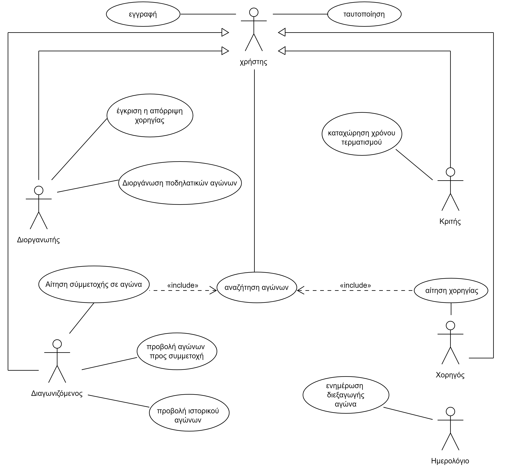
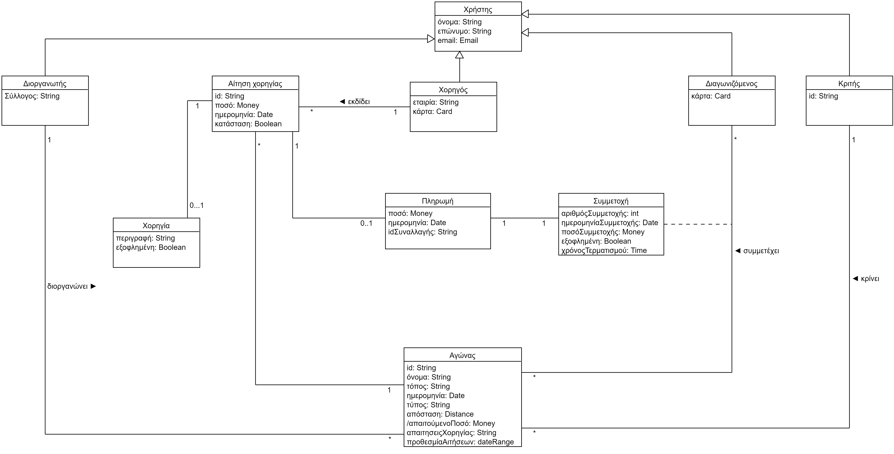

# Εισαγωγή
Η εφαρμογή που θα υλοποιήσουμε, στοχεύει στην ανάπτυξη ενός λογισμικού διεξαγωγής αγώνων ποδηλασίας.
## Εμβέλεια
Η εφαρμογή θα αποτελείται από 4 βασικούς ρόλους:
*   Διοργανωτή
*   Διαγωνιζόμενο
*   Χορηγό
*   Κριτή
### Διοργανωτής
Η εφαρμογή θα δίνει τη δυνατότητα στους διοργανωτές να διοργανώνουν και να ανακοινώνουν τους αγώνες τους. 
### Διαγωνιζόμενος
Η εφαρμογή θα επιτρέπει στους διαγωνιζόμενους να αναζητούν αγώνες της αρέσκειάς τους και να υποβάλλουν αίτηση συμμετοχής σε αυτούς.
### Χορηγός
Η εφαρμογή θα πρσφέρει στους χορηγούς τη δυνατότητα να αναζητούν και να χρηματοδοτούν αγώνες και να προτείνει διάφορα έπαθλα.
### Κριτής
Η εφαρμογή παρέχει στους κριτές τη δυνατότητα να καταχωρούν στο σύστημα του χρόνους τερματισμού του κάθε ποδηλάτη.

## Σύντομη περιγραφή των απαιτήσεων του λογισμικού 
Η ελληνική ομοσπονδία ποδηλασίας επιθυμεί να αναπτύξει ένα λογισμικό για την υποστήριξη των fans του ποδηλάτου σε όλη τη χώρα. Η εφαρμογή αυτή αποσκοπεί στη σύνδεση των διοργανωτών αγώνων ποδηλασίας με τους ενδιαφερόμενους διαγωνιζόμενους και χορηγούς. 

Οι διοργανωτές, οι οποίοι θα είναι σύλλογοι ποδηλάτων, μπορούν να δημιουργούν αγώνες ποδηλασίας και να τους δημοσιεύουν. Το σύστημα θα παρουσιάζει μια φόρμα προς συμπλήρωση στους διοργανωτές. Κατά τη δημιουργία των αγώνων, οι διοργανωτές, θα μπορούν να ορίζουν τη τοποθεσία διεξαγωγής του αγώνα, την ώρα και την ημερομηνία, το τύπο καθώς επίσης και να θέτουν ένα ελάχιστο όριο χρημάτων που θα πρέπει να προσφερθούν από χορηγούς και από τις αιτήσεις συμμετοχής. Εάν όλα τα στοιχεία καταχωρηθούν σωστά και η ημερομηνία και ο τόπος διεξαγωγής είναι διαθέσιμα, τότε το σύστημα καταχωρεί τον αγώνα. Διαφορετικά ζητείται εκ νέου η εισαγωγή των στοιχείων. Οι διοργανωτές έχουν τη δυνατότητα να εκδίδουν προσφορές σε χορηγούς. Οι διοργανωτές θέτουν προθεσμία για την υποβολή αιτήσεων συμμετοχής και για προσφορά χορηγιών. 

Οι διαγωνιζόμενοι αναζητούν αγώνες βάσει της ημερομηνίας ή του τύπου αγώνα ποδηλασίας που επιθυμούν (street, offroad). Αφού ο διαγωνιζόμενος επιλέξει έναν αγώνα, το σύστημα εμφανίζει όλες τις σχετικές πληροφορίες για τον αγώνα. Ο διαγωνιζόμενος δηλώνει συμμετοχή σε αγώνες που τον ενδιαφέρουν. Η συμμετοχή στους αγώνες προϋποθέτει τη πληρωμή του ποσού συμμετοχής που έχει τεθεί απο το διοργανωτή του συγκεκριμένου αγώνα. Το σύστημα θα ζητά απο το χρήστη τα στοιχεία της κάρτας του. Εάν είναι έγκαιρα τότε γίνεται καταχώριση του διαγωνιζόμενου στον αγώνα. Το σύστημα ενημερώνει μέσω email τον διαγωνιζόμενο για την εγγραφή του. Σε άλλη περίπτωση ζητείται εκ νέου η εισαγωγή των στοιχείων πληρωμής. Μέσω του μενού της εφαρμογής, οι διαγωνιζόμενοι θα μπορούν να δουν όλους τους αγώνες στους οποίους έχουν δηλώσει συμμετοχή και έχουν συμμετάσχει στο παρελθόν.

Οι χορηγοί αναζητούν αγώνες βάσει της ημερομηνίας ή του τύπου αγώνα ποδηλασίας. Αφού ο χορηγός επιλέξει έναν αγώνα, το σύστημα εμφανίζει όλες τις πληροφορίες για τη χωρηγία του αγώνα. Ο χορηγός επιλέγει τον αγώνα που θέλει να χρηματοδοτήσει. Το σύστημα εμφανίζει μια φόρμα αίτησης χορηγίας την οποία συμπληρώνει ο χορηγός. Εάν η φόρμα συμπληρωθεί επιτυχώς, το σύστημα ενημερώνει μέσω email τον χορηγό για την επιτυχή υποβολή της αίτησής του. Σε περίπτωση λανθασμένης συμπλήρωσης της φόρμας το σύστημα ζητά εκ νεου υποβολή της αίτησης. Το σύστημα εμφανίζει στο διοργανωτή την αίτηση του χορηγού. Ο διοργανωτής μπορεί να αποδεχτεί είτε να απορρίψει τη χορηγία. Το σύστημα ενημερώνει το χορηγό για την απόφαση του διοργανωτή. Το σύστημα ελέγχει αν έχει συμπληρωθεί το ελάχιστο ποσό και αν αυτό έχει συμβεί τότε γίνεται χρέωση του ποσού που απαιτείται για τη συμμετοχή του κάθε αθλητή και του χορηγού αντίστοιχα. Το σύστημα ενημερώνει μέσω email τους διαγωνιζόμενους για την διεξαγωγή του αγώνα καθώς και για τον αριθμό συμμετοχής τους.Διαφορετικά, αν δεν συμπληρωθεί το απαιτούμενο ελάχιστο ποσό ο αγώνας δεν θα διεξάγεται και θα αφαιρείται απο το σύστημα. 

Οι κριτές καταχωρούν στο σύστημα το χρόνο τερματισμού κάθε ποδηλάτη. Το σύστημα, βάσει των χρόνων τερματισμού θα ανακοινώνει την τελική κατάταξη και θα ανακυρήσσει τον νικητή του αγώνα. Μετά την ολοκλήρωση του αγώνα, το σύστημα θα κληρώνει τα δώρα που έχουν προσφέρει η χορηγοί στους διαγωνιζόμενους.

Οι χρήστες της εφαρμογής θα μπορούν να χρησιμοποιήσουν τις λειτουργίες της εφαρμογής εφόσον έχουν εγγραφτεί και ταυτοποιηθεί απο το σύστημα.

## Επισκόπηση μοντέλου περιπτώσεων χρήσης

| use case | description |
| :----------------------| :---------|
| [Εγγραφή](docs/markdown/uc0-sign-up.md) | O χρήστης εγγράφεται στο σύστημα.
| [Ταυτοποίηση](docs/markdown/uc1-authentication.md) | Το σύστημα ταυτοποιεί το χρήστη. Η ταυτοποίση απαιτεί προϋπόθεση για όλες τις ενέργεις των χρηστών στο σύστημα.
| [Διοργάνωση ποδηλατικών αγώνων](docs/markdown/uc2-bike-race-organization.md)  | Ο διοργανωτής δημιουργεί και δημοσιεύει αγώνες στο σύστημα.
| [Έγκριση η απόρριψη χορηγίας](docs/markdown/uc3-approve-sponsorship.md)  | Ο διοργανωτής εγκρίνει και απορρίπτει αιτήσεις για χορηγίες.
| [Αναζήτηση αγώνων](docs/markdown/uc4_search.md)  | Ο χρήστης αναζητά αγώνες.
| [Συμμετοχή σε αγώνα](docs/markdown/uc5_application_to_participate.md) | Ο χρήστης συμμετέχει σε αγώνες.
| [Προβολή αγώνων](docs/markdown/uc6_view_races.md)  | Ο χρήστης βλέπει τους αγώνες στους οποίους που έχει δηλώσει συμμετοχή ή και τους αγώνες που είχε συμμετάσχει στο παρελθόν.
| [Αίτηση χορηγίας](docs/markdown/uc7_request_donation.md)  | Ο χορηγός κάνει αίτηση σε αγώνες για χορηγία.	
| [Kαταχώρηση χρόνου τερματισμού](docs/markdown/uc8_submiting_time.md )  | Ο κριτής καταχωρεί για κάθε διαγωνιζόμενο το χρόνο τερματισμού του στο σύστημα.
| [Ενημέρωση διεξαγώγης αγώνα](docs/markdown/uc9_reminder.md)  | Το ημερολόγιο ενημερώνει τους διαγωνιζόμενους για την τελική διεξαγωγή του αγώνα.

## Επισκόπηση μοντέλου πεδίου
