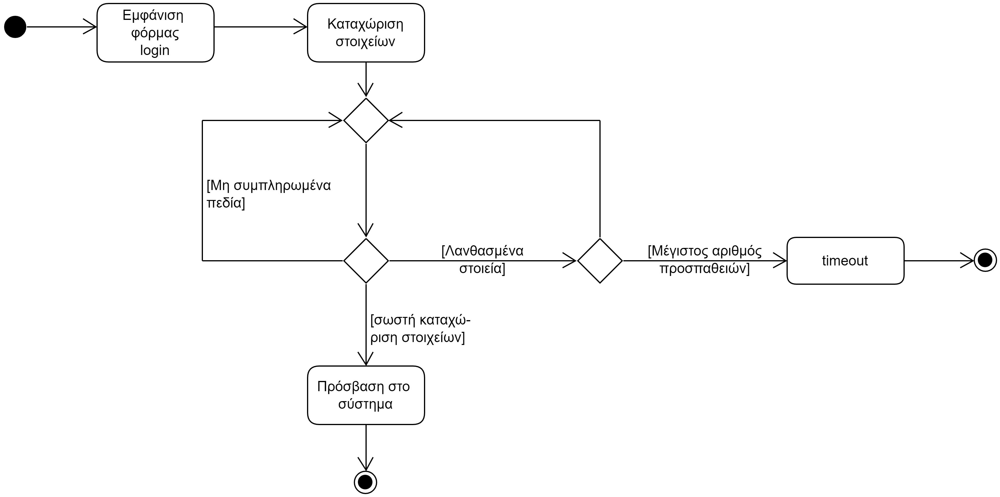
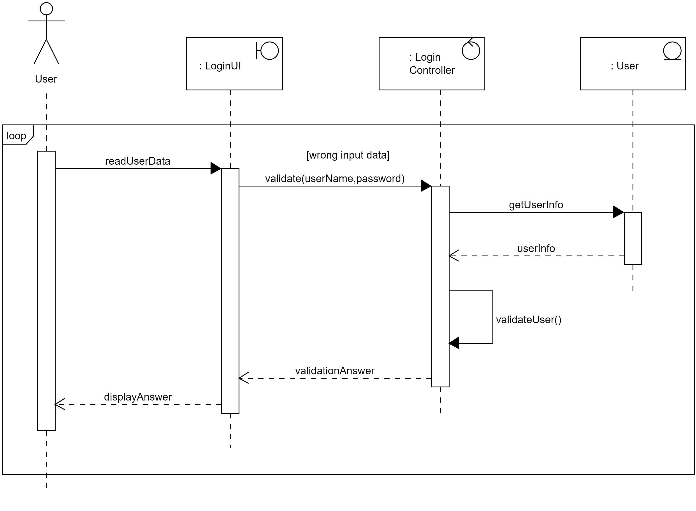

# ΠΧ1. Ταυτοποίηση
**Πρωτεύον Actor**: Χρήστης

**Ενδιαφερόμενοι:**  
**Χρήστης**: Θέλει να εισέρχεται στο σύστημα με το δικό του λογαριασμό.

**Προϋποθέσεις**: Ο Διοργανωτής έχει εκτελέσει με επιτυχία την περίπτωση χρήσης "Εγγραφή".

# Βασική Ροή
1. Το σύστημα ζητά απο το χρήστη να εισάγει:
   * ονοματεπώνυμο
   * συνθηματικό 
2. Ο χρήστης εισάγει ονοματεπώνυμο και το συνθηματικό του.
3. Το σύστημα εμφανίζει μύνημα επιτυχούς πρόσβασης.
   
**Εναλλακτικές Ροές**

*2α. Ο χρήστης δεν εισήγαγε κάποιο απο τα στοιχεία ονοματεπώνυμο ή και συνθηματικό.*
1. Το σύστημα εμφανίζει κατάλληλο μύνημα σφάλματος.
2. Η ΠΧ επιστρέφει στο βήμα 1 της βασικής ροής.

*2β. Το ονοματεπώνυμο ή και ο κωδικός είναι λανθασμένα.*
1. Το σύστημα εμφανίζει κατάλληλο μύνημα.
2. Η ΠΧ επιστρέφει στο βήμα 1 της βασικής ροής.
3. Μετά απο κάποιο αριθμό φορών, το σύστημα θέτει timeout στο χρήστη.

## Διάγραµµα δραστηριοτήτων

## Διάγραµµα ακολουθίας

