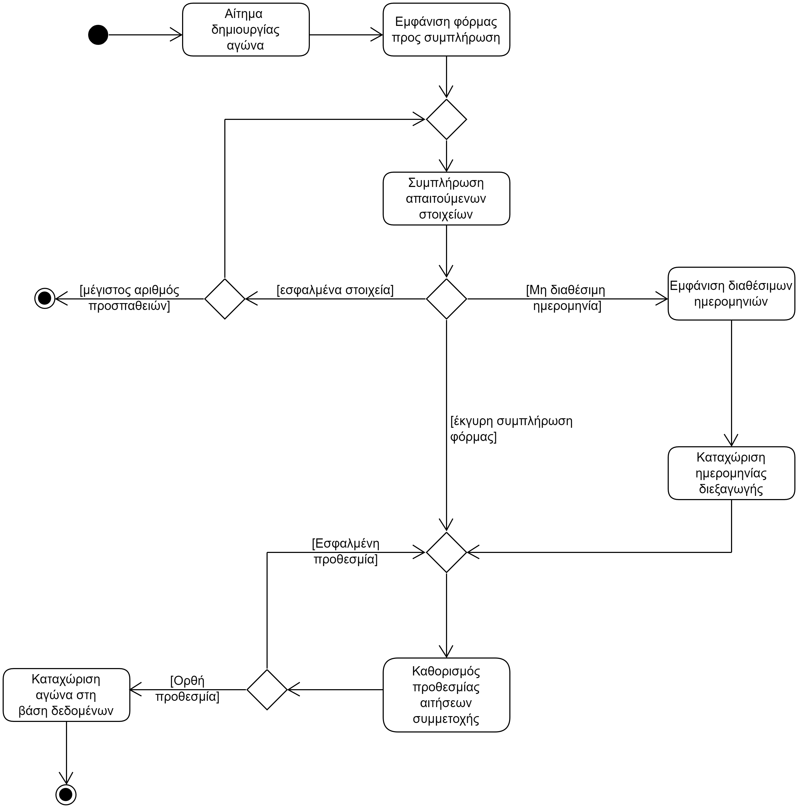
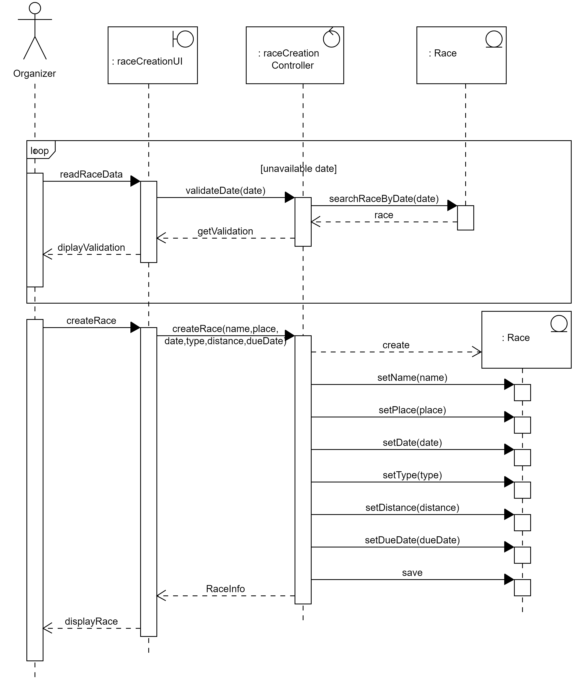

# ΠΧ2. Διοργάνωση ποδηλατικών αγώνων
**Πρωτεύον Actor**: Διογρανωτής

**Ενδιαφερόμενοι**  
*   **Διοργανωτής**: Θέλει να διοργανώνει αγώνες ποδηλασίας.
*   **Διαγωνιζόμενος**: Θέλει να συμμετέχει σε αγώνες ποδηλασίας της προτίμησής του.
*   **Χορηγός**: Θέλει να χρηματοδοτεί αγώνες προκειμένου να διαφημιστεί.
*   **Κριτής**: Θέλει να καταχωρεί τους χρόνους τερματισμού των αγώνων.

**Προϋποθέσεις**: Ο Διοργανωτής έχει εκτελέσει με επιτυχία την περίπτωση χρήσης "Ταυτοποίση".

# Βασική Ροή
1. Ο διοργανωτής επιλέγει τη λειτουργία δημιουργία διοργάνωση ποδηλατικού αγώνα.
2. Το σύστημα εμφανίζει κατάλληλη φόρμα με πεδία προς συμπλήρωση:
    * όνομα αγώνα
    * τόπος διεξαγωγής του αγώνα
    * ημερομηνία διεξαγωγής του αγώνα
    * τύπος του αγώνα (offroad ή street)
    * απόσταση του αγώνα
    * ποσό συμμετοχής για τον αγώνα
    * ελαχιστό ποσό για τη διεξαγωγή του αγώνα
3. Ο διοργανωτής συμπληρώνει τα απαιτούμενα στοιχεία
4. Το σύστημα ζητά για καταχώριση:
   * απαιτήσεων χορηγίας
   * προθεσμία υποβολλής χορηγιών και αιτήσεων συμμετοχής
5. Ο διοργανωτής καταχωρεί τα στοιχεία.
6. Το σύστημα εμφανίζει μύνημα επιτυχούς δημιουργίας του αγώνα.
   
**Εναλλακτικές Ροές**

*3α. Ο διοργανωτής δεν εισήγαγε κάποιο απο τα απαραίτητα στοιχεία όνομα, τόπος, ημερομηνία, τύπος και απόσταση.*
1. Το σύστημα εμφανίζει κατάλληλο μύνημα σφάλματος.
2. Η ΠΧ επιστρέφει στο βήμα 2 της βασικής ροής.
3. Μετά απο κάποιον αριθμό φορών η περίπτωση χρήσης τερματίζει.
   
*3β. Έχει διοργανωθεί άλλος αγώνας εκείνη την ημερομηνία στη συγκεκριμένη τοποθεσία*
1. Το σύστημα εμφανίζει κατάλληλο μύνημα.
2. Το σύστημα εμφανίζει τις διαθέσιμες ημερομηνίες για τη συγκεκριμένη τοποθεσία.
3. Το σύστημα ζητά εκ νέου ημερομηνία διεξαγωγής του αγώνα.
4. Η περίπτωση χρήσης επιστρέφει στο βήμα 4 της βασικής ροής.

*5α. Ο διοργανωτής καταχώρησε εσφαλμένα στοιχεία.*
1. Το σύστημα εμφανίζει κατάλληλο μύνημα σφάλματος.
2. Η περίπτωση χρήσης επιστρέφει στο βήμα 4 της βασικής ροής.

## Διάγραµµα δραστηριοτήτων

## Διάγραµµα ακολουθίας
