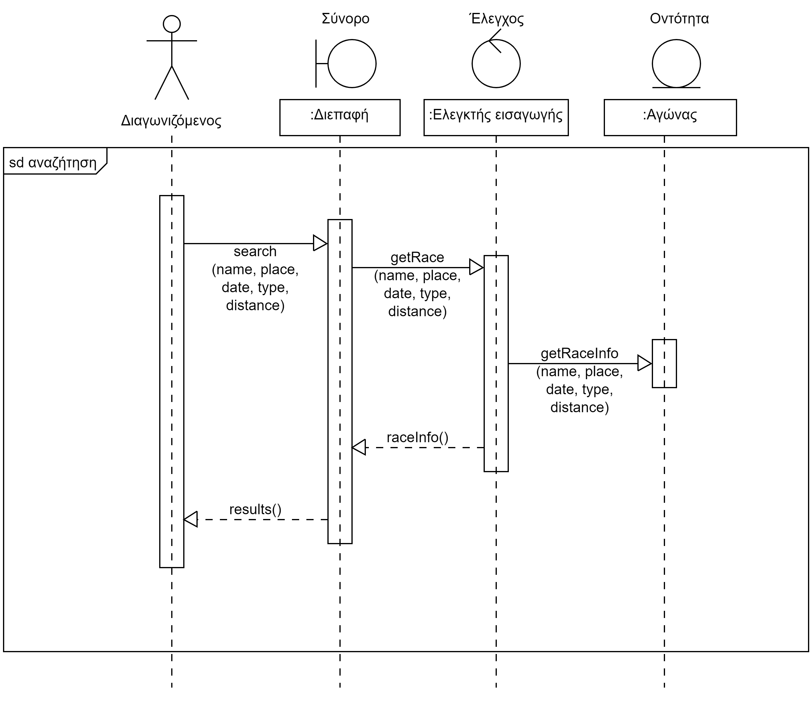

# Περίπτωση Χρήσης 4: Αναζήτηση αγώνων
**Πρωτεύων Actor**: Χρήστης

***Ενδιαφερόμενοι:***

*   **Διοργανωτής**: Θέλει να αναζητάει αγώνες για να μπορεί να δει ποιοι άλλοι αγώνες γίνονται ποτέ και που, για να ξέρει πότε και που να διοργανώσει τους δικούς του αγώνες.
*   **Διαγωνιζόμενος**: Θέλει να αναζητάει αγώνες για να μπορεί να βρει και να δηλώσει αγώνες που τον ενδιαφέρουν
*   **Χορηγός**: Θέλει να αναζητάει αγώνες για να μπορεί να βρει και να χορηγήσει αγώνες που τον ενδιαφέρουν
*   **Κριτής**: Θέλει να αναζητάει αγώνες για να μπορεί να βρει αγώνες που οφείλει να βαθμολογήσει διαγωνιζόμενους

**Προϋποθέσεις**: Ο Χρήστης έχει εκτελέσει με επιτυχία την περίπτωση χρήσης “Ταυτοποίηση".  

## Βασική Ροή
1.	Ο χρήστης επιλέγει την αναζήτηση αγώνα
2.	Το σύστημα προτρέπει την εισαγωγή του χρήστη
3.	Ο χρήστης αναζητεί τον αγώνα βάσει:
    * ονόματος
    * τόπου
    * ημερομηνίας
    * τύπου
    * απόστασης
4.	Το σύστημα εμφανίζει τους διαθεσίμους αγώνες με τα κριτήρια που έχει θέσει ο διαγωνιζόμενος.

**Εναλλακτικές Ροές**

*4α. Δεν υπάρχει αγώνας που πληροί τις προτιμήσεις του διαγωνιζομένου..*  
1. Το σύστημα εμφανίζει αντίστοιχο μήνυμα (δηλαδή μήνυμα που δηλώνει ότι δεν υπάρχουν αγώνες με αυτές τις προτιμήσεις) 
2. Η περίπτωση χρήσης επιστρέφει στο 1ο βήμα της βασικής ροής

## Διαγραμμα ακολουθίας
