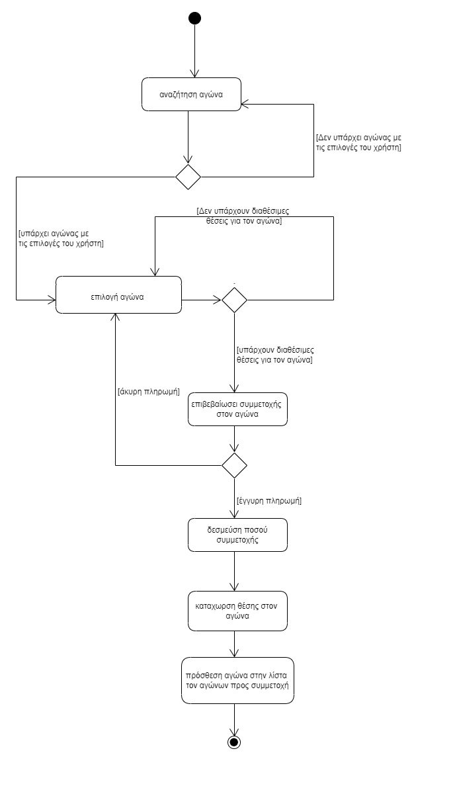
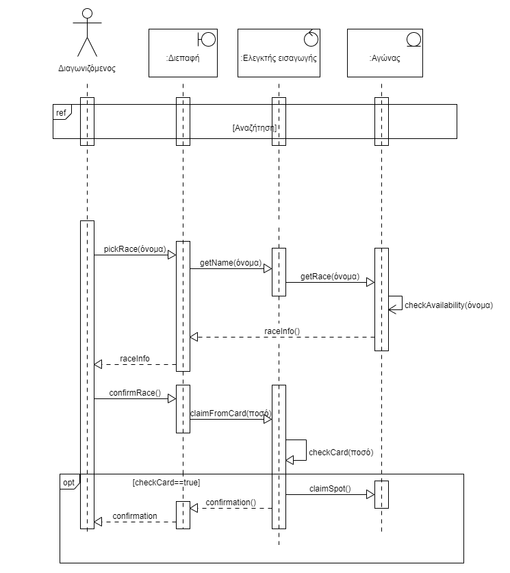

# Περίπτωση Χρήσης 5: Αίτηση συμμέτοχης σε αγώνα
**Πρωτεύων Actor**: Διαγωνιζόμενος

***Ενδιαφερόμενοι:***

* **Διαγωνιζόμενος**: 	Θέλει να μπορεί να κάνει την αίτηση συμμετοχής για να συμμετάσχει στον αγώνα
* **Διοργανωτής**: Θέλει να ξέρει ποιοι και πόσοι διαγωνιζόμενοι έχουν λάβει μέρος στον αγώνα .  

**Προϋποθέσεις**: Ο Διαγωνιζόμενος έχει εκτελέσει με επιτυχία την περίπτωση χρήσης “Ταυτοποίηση".  

## Βασική Ροή
1.  Το πρώτο βήμα της βασικής ροής είναι η [Περίπτωση χρήσης Αναζητησης](uc4_search.md) 
2.	Ο διαγωνιζόμενος επιλέγει τον αγώνα που θέλει να συμμετάσχει.
3.	Το σύστημα παρουσιάζει περισσότερες πληροφορίες για τον αγώνα και το ποσό που θα δεσμευθεί από την κάρτα του διαγωνιζόμενου.
4.	Ο διαγωνιζόμενος επιβεβαιώνει την θέληση του να συμμετάσχει στον αγώνα.
5.	Το σύστημα δεσμεύει το ποσό συμμετοχής και καταχωρεί μια θέση για τον διαγωνιζόμενο στον αγώνα που έγινε η δήλωση.
6.	Το σύστημα προσθέτει τον αγώνα στην λίστα τον αγώνων προς συμμετοχή.
7.  Το σύστημα επιστρέφει μήνυμα επιτυχούς δέσμευσης.

**Εναλλακτικές Ροές**

*1α. Δεν υπάρχει αγώνας που πληροί τις προτιμήσεις του διαγωνιζομένου..*  
1. Το σύστημα εμφανίζει αντίστοιχο μήνυμα (δηλαδή μήνυμα που δηλώνει ότι δεν υπάρχουν αγώνες με αυτές τις προτιμήσεις) 
2. Η περίπτωση χρήσης επιστρέφει στο 1ο βήμα της βασικής ροής

*3α. Δεν υπάρχουν διαθέσιμες θέσεις για τον αγώνα*
1.	Το σύστημα εμφανίζει κατάλληλο μήνυμα και αποτρέπει τον χρήστη από το να κάνει δήλωση
2.  Η περίπτωση χρήσης επιστρέφει στο 2ο βήμα της βασικής ροής

*5α. Η κάρτα του διαγωνιζόμενου είναι δεν έχει το κατάλληλο ποσό συμμετοχής*
1.	Το σύστημα εμφανίζει κατάλληλο μήνυμα σφάλματος
2.	Η περίπτωση χρήσης επιστρέφει στο βήμα 2ο της βασικής ροής

## Διάγραµµα δραστηριοτήτων

## Διαγραμμα ακολουθίας

