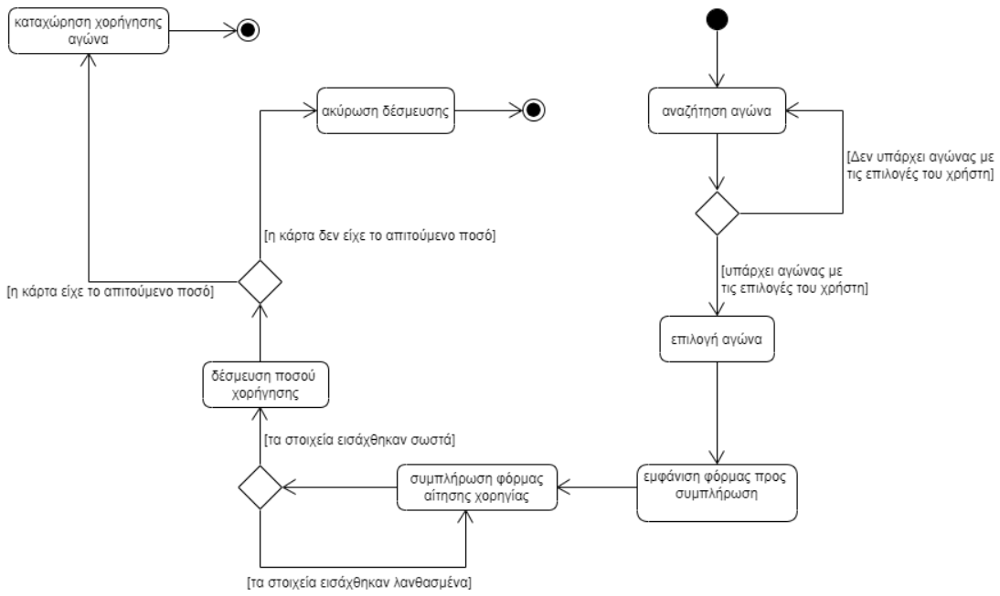
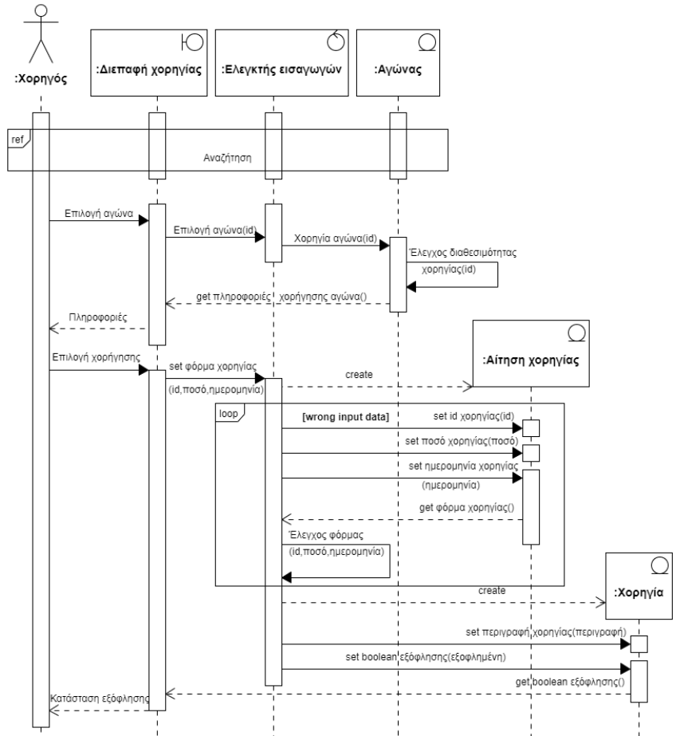

# **Περίπτωση Χρήσης 7: Αίτηση χορηγίας** 

 **Πρωτεύων Actor**: Χορηγός

**Ενδιαφερόμενοι**: 

* **Χορηγός**: Θέλει να χωρηγήση τον έναν αγώνα.

**Προϋποθέσεις**: Ο χρήστης έχει εκτελέσει με επιτυχία την περίπτωση χρήσης [“Ταυτοποίηση"](uc1-authentication.md).

## **Βασική Ροή**
 
1. Το πρώτο βήμα της βασικής ροής είναι η περίπτωση χρήσης [Αναζήτηση αγώνων](uc4_search.md).
2. Ο χορηγός επιλέγει τον αγώνα.
3. Το σύστημα εμφανίζει κατάλληλη φόρμα με όλες τις πληροφορίες για τη χωρηγία του αγώνα.
4. Το σύστημα εμφανίζει μια φόρμα αίτησης χορηγίας.
5. Ο χορηγός συμπληρώνει τη φόρμα με τα κατάλληλα στοιχεία.
6. Το σύστημα δεσμεύει το προαπαιτούμενο ποσό από τον χορηγό.
7. Το σύστημα ενημερώνει τον χορηγό για την επιτυχή υποβολή της αίτησής του.

**Εναλλακτικές Ροές**

1α. *Δεν υπάρχει αγώνας που πληροί τις προτιμήσεις του χορηγού.*

   1. Ο χορηγός πατάει το κουμπί "back".
   2. Η περίπτωση χρήσης επιστρέφει στο 1ο βήμα της βασικής ροής.

5α. *Ο χορηγός σημπλήρωσε τη φόρμα αίτησης χορηγίας λανθασμένα.*  

   1. Το σύστημα εμφανίζει μήνυμα λάθους.
   2. Ο χορηγός πατάει το κουμπί "back".
   3. Η περίπτωση χρήσης επιστρέφει στο 4ο βήμα της βασικής ροής.
   
6α. *Ο χορηγός δεν έχει το απαιτούμενο χρηματικό ποσό.*

   1. Το σύστημα εμφανίζει αντίστοιχο μήνυμα.
   2. Η περίπτωση χρήσης τερματίζει.
   

# Διάγραµµα δραστηριοτήτων

# Διάγραµµα ακολουθίας
