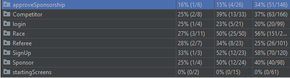

# Αναφορά κάλυψης του κώδικα
Παρακάτω φαίνεται η κάλυψη όλων των πακέτων με τη χρήση των JUnit test.

* Κάλυψη όλων των packages.
  

* Κάλυψη του package model
  

* Κάλυψη του package util
  

* Κάλυψη του package contacts
  

-------------------------------------------------------------------------

## Αναφορά κάλυψης του για το package views

* ### κάλυψης του για το package views

* Κάλυψη του package Sponsor
  

* Κάλυψη του package ViewRaces
  

* Κάλυψη του package AproveSponsorship
  

* Κάλυψη του package CreateRace
  

* Κάλυψη του package Login
  

* Κάλυψη του package RaceRegistration
  

* Κάλυψη του package RaceSearch
  

* Κάλυψη του package RefereeRace
  

* Κάλυψη του package RefereeRate
  

* Κάλυψη του package SignUp
  

